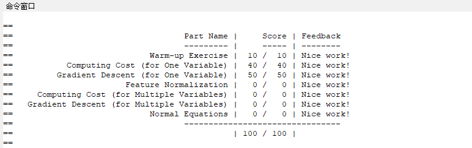
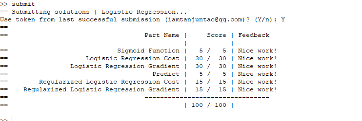
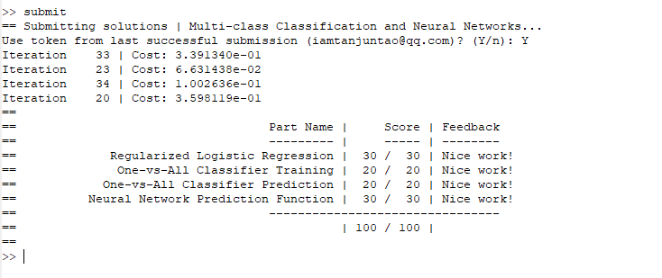

# Stanford-ML-AndrewNg-ProgrammingAssignment
> 最近在学习Andrew Ng的机器学习课程，希望自己能够坚持下来，一边观看教程，一边能够将所有的课程代码都实现，加油，你是最棒的！:yum:

### 完成 Linear Regression :yum:

### 完成 Logistic Regression :yum:

### 完成 one-vs-all 算法以及 FeedPropagation 算法 :yum:
