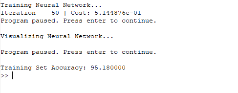
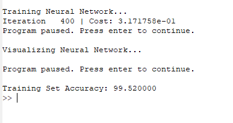
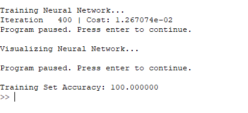

### 设置不同的学习参数
本次作业的 Neural Network 模型中的参数主要有两个：
> 1. **iteration**：matlab中的优化函数fminch的迭代次数   
> 2. **lambda**：正则项参数

#### Case1 
```
iteration = 50
lambda = 1
```
***训练的结果是这样的：***     



准确率可以达到95%左右。


#### Case2
```
iteration = 400
lambda = 1
```
***训练的结果是这样的：***   
     
准确率已经接近100%了。


#### Case3
```
iteration = 400
lambda = 0.01
```
***训练的结果是这样的：***    


准确率达到了**惊人的100%**。  
   


可以得出一个明显的结论就是：**随着迭代次数的增多，模型的准确性越来越高，甚至可以达到100%的准确性！可以说 Neural Network 模型真的是很神奇很神奇！**
