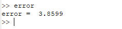
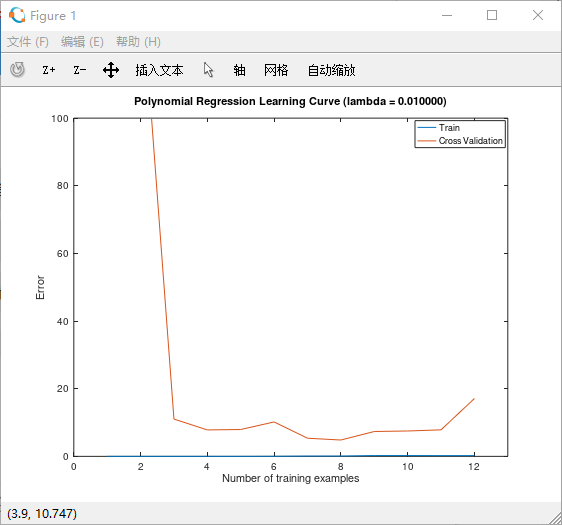
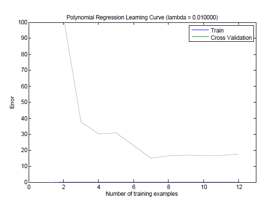

## Ungraded部分

### 1. Computing test set error
**问题**：计算测试集的误差
``` matlab
% 使用参数lambda = 3
% 直接在ex5.m中添加

theta = trainLinearReg(X_poly, y, 3);
[error useless] = linearRegCostFunction(X_poly_test, ytest, theta, 0);
error
```
最后计算出来的`error`和指导书上面的一致：   




### 2. Plotting learning curves with randomly selected examples
**问题**：随机选取`i`个 examples ，然后用这些 examples 来训练 model ，计算 error。重复计算50次最后将所有的 error 累加取平均值，最终得到 i 个 example 对应的 error。  

**解决方法**：新建一个文件`learningCurveUngraded.m`
``` matlab
function [error_train, error_val] = ...
    learningCurveUngraded(X, y, Xval, yval, lambda)
    %% 本函数供作业后面ungraded部分使用，即随机选择i个example然后重复50次
    %% 在计算平均值作为最终的error

m = size(X, 1);

error_train = zeros(m, 1);
error_val   = zeros(m, 1);


num_iterations = 50;
for i = 1:m
  for j = 1:num_iterations
    sel = randperm(m);
    sel = (1:i);
    dataX = X(sel, :);
    dataY = y(sel, :);
    theta = trainLinearReg(dataX, dataY, lambda);
    [J1 grad1] = linearRegCostFunction(dataX, dataY, theta, 0);
    error_train(i) = error_train(i) + J1;
    [J2 grad2] = linearRegCostFunction(Xval, yval, theta, 0);
    error_val(i) = error_val(i) + J2;
  endfor  
  
  error_train(i) = error_train(i) / num_iterations;
  error_val(i) = error_val(i) / num_iterations;
  
endfor
end
```

然后再`ex5.m`中添加：
``` matlab
% 选修部分：实践中，每次总是随机选择i个example来训练，然后用这个训练得到的模型来计算error
% 对于第i中情况，即需要选择i个example，重复计算50次误差然后取平均值得到第i中情况下的error
lambda = 0.01;
[error_train, error_val] = ...
              learningCurveUngraded(X_poly, y, X_poly_val, yval, lambda);

plot(1:m, error_train, 1:m, error_val);
title(sprintf('Polynomial Regression Learning Curve (lambda = %f)', lambda));
xlabel('Number of training examples')
ylabel('Error')
axis([0 13 0 100])
legend('Train', 'Cross Validation')
```

最后绘制出来的`learning curve`:    



指导书上面的`learning curve`:   



基本上是一样的，说明代码实现正确。

**顺利完成！**


