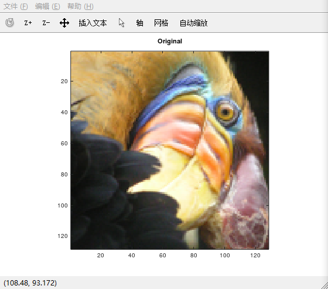
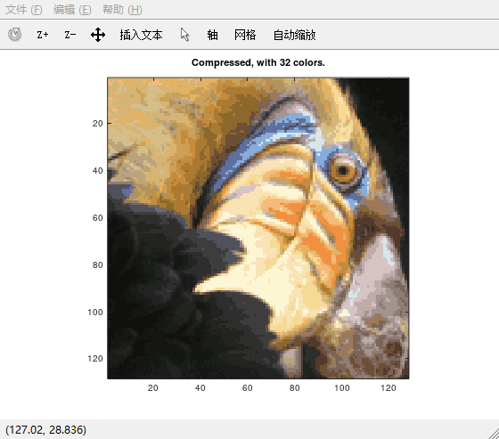
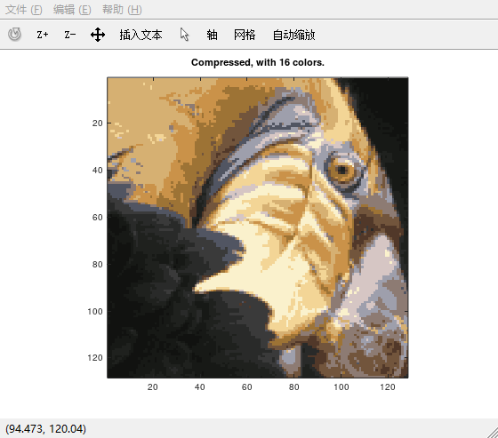
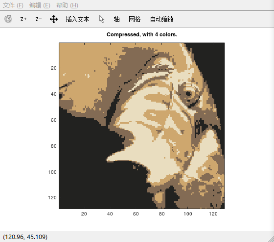
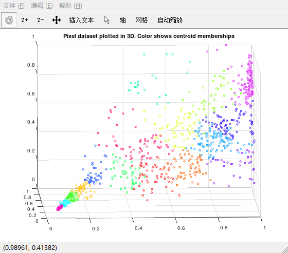
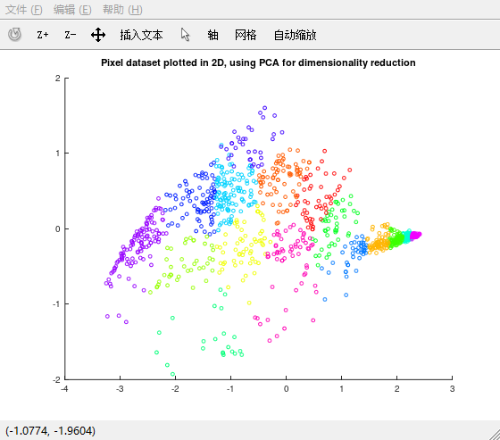

## 一、K-Means 算法做 image compression

**原理**：一副图片是由一个个`pixel(像素)`组成的，如果图片采用`RGB`方式编码的话，则每个`pixel`包含`24bits`，每`8bits`为一组，分别表示`R`、`G`、`B`的色彩值，值为`0-255`之间的整数。一般情况下，每个 pixel 的RGB值都是不一样的，结果就是每个 pixel 的颜色不一样，所以原始的图片色彩很鲜艳，包含很多的图片细节。使用 K-Means 算法压缩图片，就是将所有的 color 聚类到 K 类，从而原始图片中每个 pixel 的色彩值，就可以用这个 pixel 所在的 cluster 的 centroid 的色彩值来代替，使得 compressed image 中只包含 K 种 color，从而每个 pixel 只需要保存其所在的 cluster 的索引，而不是原始的 RGB 的颜色值。  

**eg**:如果我们有一副 32*32 的图片，那么我们需要`32*32*24 = 24576bits`来存储这幅图片。如果我们是用`K=16`来调用 K-Means 算法，那么现在需要`16*24 + 32*32*4 = 4480bits`来存储图片。可以看到，使用 K-Means 算法能够大幅度的减少图片所需要的存储空间，但是，**图片的细节受到不同程度的损失，这取决于K的大小。**

**1. 原始图片**   

  

**2. K = 32 的压缩结果**  

**3. K = 16 的压缩结果**  

**4. K = 8 的压缩结果**   

**5. K = 4 的压缩结果**   

**结论：随着 K 值不断减小，用来表示图片的颜色的种类数越来越少，图片越来越不显眼，越来越丢失更多的细节信息。**

---

## 二、PCA 算法

* *PCA 算法的一些原理还有一些使用方面应该注意的信息，可以看`docs`文件夹中的PDF文件。*  

**使用 PCA 算法将数据从 3D 降维到 2D**

从上面的原始图片的像素点中选择1000个，在3D空间中可视化这些像素点。   

3D中显示数据点一个问题是：不太容易观察。所以最好是将数据降维到2D中。

`ex7.pdf`指导书上是这么描述的：   
> The PCA projection can be thought of as a rotation that selects
the view that maximizes the spread of the data, which often corresponds to
the "best" view.
> 

字面理解：在3D空间中找到一个数据延伸最广的方向来投影3D数据   
内含：其实是找到原始数据中方差变化最大的方向，将原始的数据朝这个方向投影，从而保证能够保留最多的方差，这也是 PCA 算法最核心的思想。