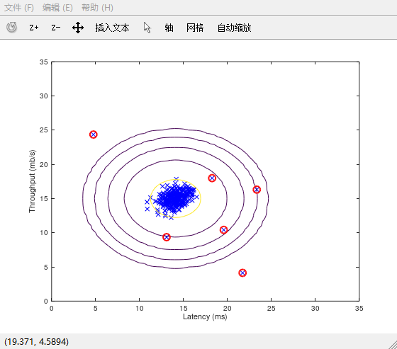
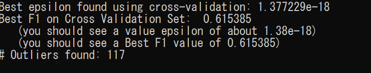
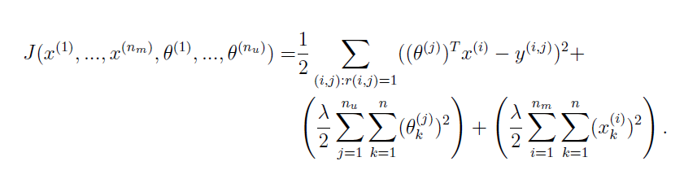
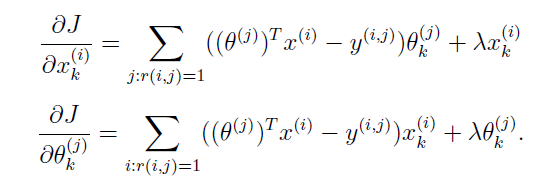

## 1. Anomaly Detection
**使用的 Model：Multivariate Gaussian Distribution**  

`算法过程`
1. 首先参数估计（**使用的是training set,都是无异常的样本**）
    * 估计每个 feature 的 `mu` 和 `sigma^2`
        + `mu`的值为每个特征的平均值
        + `sigma^2`不能直接使用`var`函数来求，因为这个函数统计的是`(m-1)`个样本，但是机器学习算法中的方差统计的是`m`个样本。因此需要自己手动去计算。
        + 多元高斯分布模型中，需要将`sigma^2`向量转换为`covariance matrix`。一般情况下，每个 feature 之间是不相关的，因此各个 feature 之间的`相关系数ρ = 0`，所以协方差矩阵只需要将`sigma^2`的所有值放在对角线上面即可。
2. 使用多元高斯分布概率密度函数计算每个 example 的概率值
    * 计算公式：`p = (2 * pi) ^ (- k / 2) * det(Sigma2) ^ (-0.5) * 
    exp(-0.5 * sum(bsxfun(@times, X * pinv(Sigma2), X), 2));`
3. 使用cross validation set（包含正常样本和异常样本）来选择最优的 ε 阈值
    + 交叉验证集数据中，我们已经知道每个样本的 label
    + 我们可以循环尝试不同的 ε，然后使用这个阈值来划分模型预测得到的概率值，即：p >= ε,那么为`nonanomaly`，反之 p < ε,那么为`anomaly`
    + 然后计算`precision`和`recall`。**为什么要计算这些而不是直接用准确率来衡量算法预测的好坏呢？**那是因为交叉验证集是偏斜类，即包含大量正常的样本，极少量的异常样本，不能用`accuracy`来衡量算法的预测效果，需要使用`F1-score`
    + 在计算`true positive`,`false positive`,`false negetive`几个值时，有运算的小技巧：使用 & 运算符
        ``` matlab
        predictions = (pval < epsilon);
        tp = sum((predictions == 1) & (yval == 1));
        fp = sum((predictions == 1) & (yval == 0));
        fn = sum((predictions == 0) & (yval == 1));
       ```
    + 最后计算使得`F1-score`最大的那个 ε，作为最终选定的阈值。
    
4. 找出异常值
    + 计算那些`pval < ε`的样本，将其归为异常

**2D 数据预测的异常值**  



**多维数据中预测的异常值数目**   



可以看到，和指导书上面给的结果是一样的，都是 117 个异常值。

---

## 2. Recommender System
**使用 Model：Collaborative Filtering Algorithm**

`算法过程`

1. 首先是需要知道这个问题中的代价函数的定义：

2. 需要能够计算代价函数的值
    * 这里面包含一些 matlab 计算技巧
    ``` matlab
    predictions = X * Theta';
    J = (1/2) * sum(sum((predictions .* R - Y .* R).^2));
    % add the regularization term
    regular_theta = (lambda/2) * sum(sum(Theta.^2));
    regular_x = (lambda/2) * sum(sum(X.^2));
    J = J + regular_theta + regular_x;
    ```
    * 特别需要注意`.*R`这个方法的使用，其结果是只保留了那些用户已经评分过的电影的计算，没评分的不参与计算过程。
3. 计算代价函数关于各个变量的偏导数

    * 使用向量化的方法，加速计算过程
    ``` matlab
    % compute the derivatives of X
    for i = 1:num_movies
        idx = find(R(i, :) == 1);
        Y_temp = Y(i, idx);
        Theta_temp = Theta(idx, :);
        X_grad(i, :) = (X(i, :) * Theta_temp' - Y_temp) * Theta_temp;
        % add the regularization term
        X_grad(i, :) = X_grad(i, :) + lambda .* X(i, :);
    end

    % compute the derivatives of Theta
    for j = 1:num_users
        idx = find(R(:, j) == 1);
        Y_temp = Y(idx, j);
        X_temp = X(idx, :);
        Theta_grad(j, :) = (X_temp' * (X_temp * Theta(j, :)' - Y_temp))';
        % add the regularization term
        Theta_grad(j, :) = Theta_grad(j, :) + lambda .* Theta(j, :);
    end
    ```
    * 尤其注意`find(R(i, :) == 1)`这个方法的使用：只找出那些用户评分过的电影的。
4. minimize cost function
    + 首先需要进行**均值化**：也就是将每个x(i)的 feature 值减去这个x(i)的平均值。**注意：这里不是减去feature的平均值，而是减去x(i)的平均值**
    + 然后随机初始化 X 和 Theta
    + 调用 fmincg 函数实现最小化代价函数(参数需要展开为向量传递进去)
    ``` matlab
    initial_parameters = [X(:); Theta(:)];

    % Set options for fmincg
    options = optimset('GradObj', 'on', 'MaxIter', 100);

    % Set Regularization
    lambda = 10;
    theta = fmincg (@(t)(cofiCostFunc(t, Ynorm, R, num_users, num_movies, ...
                                    num_features, lambda)), ...
                    initial_parameters, options);

    % Unfold the returned theta back into U and W
    X = reshape(theta(1:num_movies*num_features), num_movies, num_features);
    Theta = reshape(theta(num_movies*num_features+1:end), ...
                    num_users, num_features);

   ```
5. 为新用户做推荐
    + 首先预测每个用户对于每个电影的评价值
    ``` matlab
    predictions = X * Theta';
    % 新用户的预测值，需要加上x(i)的平均值
    my_predictions = predictions(:, 1) + Ymean;
    ```
    + 然后选择预测值最高的那些电影，推荐给用户


**协同过滤算法需要注意的一点就是：首先需要对 X 均值化，然后使用均值化后的 X 来训练模型。最后在对新样本进行预测时，预测得到的结果还需要加上之前减去的均值，猜得到最后的预测值。**
